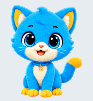

# Q咪 · Q Mimi

蓝黄配色的小猫宠物，戴着小小的黄金像素 Q。

[看看 Q咪的动作](https://aha-xiaoq.github.io/projects/q-mimi/)

## 素材

- `pet.json`：宠物配置，标识为 `q-mimi`，图集格式版本为 2。
- `spritesheet.webp`：透明动画图集，1536 × 2288 像素；8 列、11 行，每格 192 × 208 像素。
- `preview.gif`：预览动图，不作为宠物图集使用。

图集包含 9 组常规动作和 16 个观察方向。使用时保留配置与图集的文件名，并将两者放在同一目录。需要宿主支持此自定义宠物格式；这不是独立运行的桌面程序。

## 素材说明

角色图像由 AI 辅助生成。本仓库提供成品素材，未统一授予开源许可；公开可见不等于可以任意再分发或商用。使用或授权问题可通过本仓库 Issues 联系。
